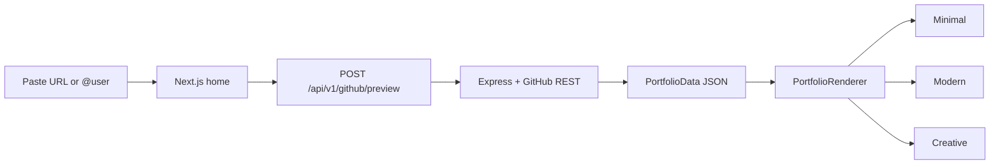

<div align="center">

<pre>
 ██████╗ ███████╗██╗   ██╗ █████╗ ███╗   ██╗████████╗ █████╗ 
 ██╔══██╗██╔════╝██║   ██║██╔══██╗████╗  ██║╚══██╔══╝██╔══██╗
 ██║  ██║█████╗  ██║   ██║███████║██╔██╗ ██║   ██║   ███████║
 ██║  ██║██╔══╝  ╚██╗ ██╔╝██╔══██║██║╚██╗██║   ██║   ██╔══██║
 ██████╔╝███████╗ ╚████╔╝ ██║  ██║██║ ╚████║   ██║   ██║  ██║
 ╚═════╝ ╚══════╝  ╚═══╝  ╚═╝  ╚═╝╚═╝  ╚═══╝   ╚═╝   ╚═╝  ╚═╝
</pre>

### **Instant portfolio previews from public GitHub data**

Paste a profile link or username → live **React** portfolio in **three visual themes** — editorial minimal, SaaS modern, or cyber creative.

<br />

[](https://nextjs.org/)
[](https://react.dev/)
[](https://tailwindcss.com/)
[](https://expressjs.com/)
[](https://www.typescriptlang.org/)

<br />

[Architecture](./ARCHITECTURE.md) · [API (preview)](#-preview-api) · [Templates](#-templates--themes)

</div>

---

## Table of contents

1. [Why Devanta?](#-why-devanta)
2. [How it works (user flow)](#-how-it-works-user-flow)
3. [Templates & themes](#-templates--themes)
4. [Data pipeline](#-data-pipeline)
5. [Repository layout](#-repository-layout)
6. [Run locally](#-run-locally)
7. [Environment variables](#-environment-variables)
8. [Preview API](#-preview-api)
9. [Scripts & quality](#-scripts--quality)
10. [Limits & troubleshooting](#-limits--troubleshooting)
11. [License](#-license)

---

## Why Devanta?

| Goal | What you get |
|------|----------------|
| **Zero signup for preview** | No account needed to try — only **public** GitHub data. |
| **One input, many looks** | Same JSON drives **Minimal**, **Modern**, and **Creative** templates. |
| **Honest data** | Featured repos = your **public** repos, ranked by **stars** (then recency). |
| **Ship-ready stack** | Next.js 14 + Tailwind + Framer Motion on the client; Express on the API. |

---

## How it works (user flow)



1. Open the app → landing **hero** with an input field.
2. Enter a **GitHub profile URL**, **repo URL** (owner is extracted), or **username** (`@optional`).
3. **Generate** → frontend calls the backend preview endpoint.
4. Backend resolves the **login**, fetches **user + public repos** from GitHub, builds **`PortfolioData`**.
5. You land in **creation view**: **preview chrome** + **template switcher** + live portfolio.
6. Switching templates **scrolls to the top** and remounts the preview so you always start at the **hero**.

---

## Templates & themes

| ID | In the UI | Vibe | Highlights |
|----|-----------|------|------------|
| `minimal` | **Editorial / Minimal** | Calm typography, full-height sections, neutral palette | Data-aware copy, 2-col repo grid, stack + stats panels, compact footer |
| `modern` | **SaaS / Modern** | Indigo–violet gradients, glass nav, motion | Full-page sections, personalized hero, 4-card “at a glance”, colorful footer strip |
| `creative` | **Legend / Creative** | Dark “OS” aesthetic, monospace, HUD widgets | Sidebar identity, neural stream stack, terminal + mini-game flourishes |

All templates:

- Handle **missing** avatar, **empty** bio, **null** repo description/language, and **empty** featured list.
- Use **`embedded`** mode under the preview chrome (no duplicate full nav where applicable).

---

## Data pipeline

**Source:** GitHub public API (no Devanta login required for preview).

| Step | Detail |
|------|--------|
| Parse input | `githubService.parseGithubUsername()` accepts profile URLs, repo URLs, or bare handles. |
| User | `GET /users/{login}` — name, avatar, bio, optional **public** email. |
| Repos | `GET /users/{login}/repos` — public repos (capped in service; sorted for portfolio build). |
| Featured | Up to **6** repos, ordered by **stargazers**, then **pushed** date. |
| Tech stack | Distinct `language` values from those featured repos. |
| Stats | Total repo count (from fetched set), sum of stars, **primary language** by frequency. |
| Contact | GitHub profile URL; **email** only if the user exposes it on GitHub. |

The canonical TypeScript shape lives in **`frontend/src/types/portfolio.ts`** (`PortfolioData`, `Project`, etc.).

---

## Repository layout

```
devanta/
├── frontend/          # Next.js 14 App Router — UI, motion, templates
│   ├── src/app/       # page.tsx (landing ↔ creation flow)
│   ├── src/components/
│   │   ├── landing/   # LandingPage, CreationView, PreviewChrome
│   │   ├── motion/    # ScrollScene3D, CreativeScrollBackdrop, …
│   │   └── templates/ # Minimal, Modern, Creative, PortfolioRenderer, TemplateSwitcher
│   └── src/lib/       # API client (fetchGithubPreview)
├── backend/           # Express API
│   └── src/
│       ├── routes/    # githubRoutes, authRoutes, portfolioRoutes, …
│       ├── services/  # githubService (preview build), …
│       └── controllers/
└── ARCHITECTURE.md    # Deeper system notes (DB, OAuth, future routes)
```

Deeper diagrams and future DB/OAuth design: **[ARCHITECTURE.md](./ARCHITECTURE.md)**.

---

## Run locally

### Prerequisites

- **Node.js 18+**
- **PostgreSQL** — only if you use OAuth / DB-backed routes; **preview-only mode does not require a database** if the server still starts (see your `db.js` / startup).

### 1. Backend API

```bash
cd backend
cp .env.example .env    # optional for preview; set GITHUB_TOKEN if you hit rate limits
npm install
npm run dev
```

- Default: **`http://localhost:5001`**
- Health: **`GET http://localhost:5001/api/v1/health`**

### 2. Frontend

```bash
cd frontend
npm install
```

Create **`frontend/.env.local`** if the API is not on localhost:5001:

```env
NEXT_PUBLIC_API_URL=http://localhost:5001
```

Optional for production metadata (Open Graph, `metadataBase`):

```env
NEXT_PUBLIC_SITE_URL=https://your-domain.com
```

```bash
npm run dev
```

Open **`http://localhost:3000`** → paste a GitHub link → **Generate**.

---

## Environment variables

### Backend (`backend/.env`)

| Variable | Preview? | Purpose |
|----------|----------|---------|
| `PORT` | ✓ | Default **5001** |
| `CLIENT_URL` | ✓ | CORS / client origin (e.g. `http://localhost:3000`) |
| `GITHUB_TOKEN` | Strongly recommended | Classic or fine-grained PAT — **higher rate limits**, fewer **403**s |
| `DATABASE_URL`, `JWT_SECRET`, `GITHUB_CLIENT_ID`, `GITHUB_CLIENT_SECRET` | OAuth / saved portfolios | Not needed for **preview only** |

See **`backend/.env.example`** for the full list.

### Frontend (`frontend/.env.local`)

| Variable | Purpose |
|----------|---------|
| `NEXT_PUBLIC_API_URL` | Backend base URL (no trailing slash) |
| `NEXT_PUBLIC_SITE_URL` | Canonical site URL for SEO / OG |

---

## Preview API

### `POST /api/v1/github/preview`

**Request body** (any of these keys work on the server):

```json
{ "input": "https://github.com/octocat" }
```

Aliases: `url`, `username` — same parsing rules.

**200 OK**

```json
{
  "message": "Preview generated from public GitHub data",
  "username": "octocat",
  "data": { /* PortfolioData */ }
}
```

**Errors**

| Status | Meaning |
|--------|---------|
| **400** | Could not parse a valid GitHub username from input |
| **404** | GitHub user does not exist |
| **403** | Rate limit or API denial — set **`GITHUB_TOKEN`** on the backend |

The Next.js client wraps this in **`fetchGithubPreview()`** (`frontend/src/lib/api.ts`).

---

## Scripts & quality

| Where | Command | What it does |
|-------|---------|----------------|
| **frontend** | `npm run dev` | Dev server |
| **frontend** | `npm run build` | Production build |
| **frontend** | `npm run lint` | ESLint |
| **frontend** | `npm test` | Vitest |
| **frontend** | `npm run verify` | **lint + test + build** (release gate) |
| **backend** | `npm run dev` | API with watch (per your `package.json`) |

---

## Limits & troubleshooting

- **Public only** — Private repos and hidden emails never appear.
- **GitHub rate limits** — Shared IPs hit limits quickly without **`GITHUB_TOKEN`**.
- **Descriptions / languages** — Nullable on GitHub; templates omit or neutralize empty fields.
- **Scroll position** — After generate or template change, the app scrolls to the **top** of the preview (`CreationView` + `key` on renderer).

---

## License

**ISC** (see `backend/package.json` — align with your org if you fork).

---

<div align="center">

**Built for builders who live on GitHub.**

*Devanta — protocol for turning public signal into presentation.*

</div>
